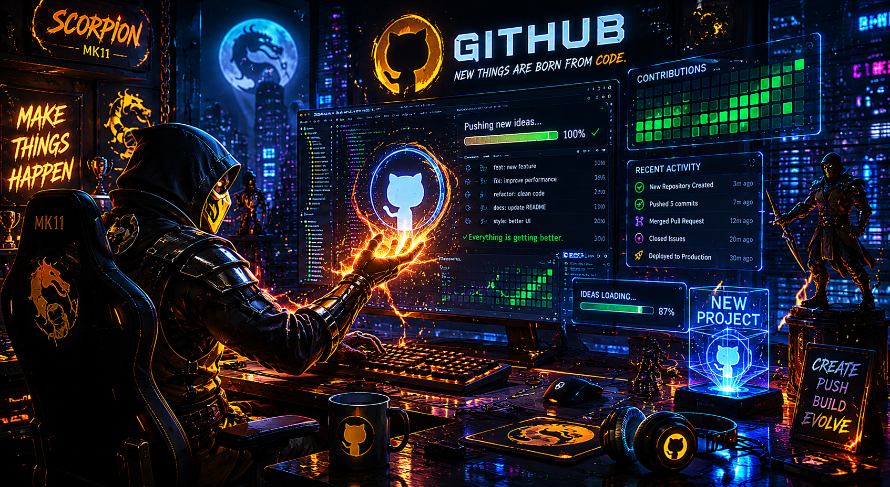

# Merhaba, Ben AlİM! 👋
### Oyun, Web ve Robotik Tutkunu Bir Software Developer

---

### 🚀 Hakkımda

* 💻 **Yazılım:** Web geliştirme tarafında projeler üretiyor; Python ve JavaScript üzerinde çalışıyorum.
* 🤖 **Donanım:** Sensörler ve LCD ekranlar kullanarak çeşitli devre projeleri tasarlıyorum.
* 🎮 **Oyun Dünyası:** Yeni oyun mekaniklerini incelemeyi, stratejiler kurmayı ve oyun projeleri geliştirmeyi seviyorum.

---

### 🛠️ Kullandığım Teknolojiler ve Diller

    

---

### 📊 GitHub İstatistikleri

---

### 🎮 Eğlence Zamanı!

  

